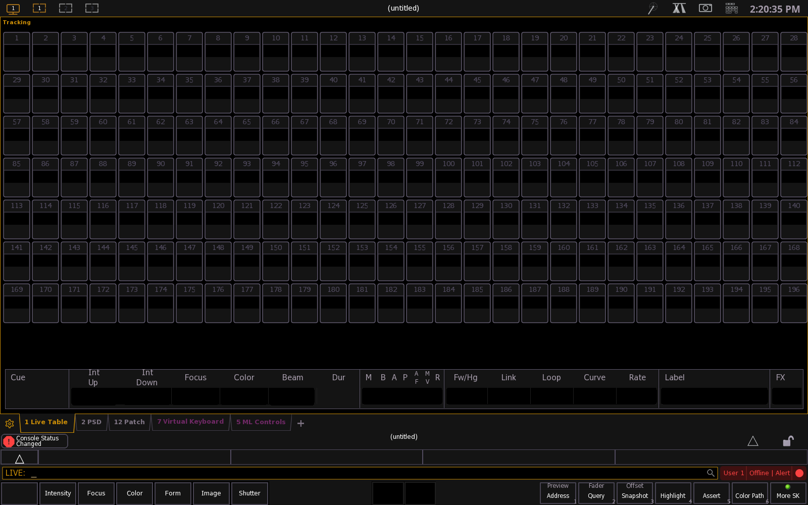

# ETC Eos Family v3.3.10.28 on Wine

`ETC_EosFamily_v3.3.10.28.exe` (Electronic Theatre Controls, "Eos Family v3 Software" — the Eos lighting
console / ETCnomad offline editor) under a locally built, patched **Wine 11.18**, with the Windows
reference taken from the libvirt guest `win11`.



## Result — the editor opens and renders, unlicensed, like on Windows

- The vendor bundle's product MSI (**WiX 3.11, x64-only**) installs cleanly and the app runs.
- The main editor window **`Eos : 1` (1600x1000)** comes up and the UI renders: OCR of the captured
  window reads the Eos command line, the cue list (`Cue Up Down Focus Color Beam Dur … Link Loop Curve
  Rate Label FX`), `LIVE: | User 1 | Offline | Alert` and `Preview / Fader / Offset` — the same surface
  the Windows reference shows.
- **No licence key is required**, matching Windows: the shell offers an *Offline* console mode and the
  editor runs unlicensed. (The product also *supports* a Sentinel HASP key; none is needed here.)
- With the SLP setup fix below, Wine matches Windows on the measurements that mattered:

| measure | Wine (before fix) | Wine (after fix) | Windows |
|---|---|---|---|
| `SLPReg() failed` lines | many (−19/interface) | **0** | 0 |
| `CreateComponent … handle=` | `ffffffff` | **`80000000`** | `80000000` |
| `recovered from hang after` | 47.9–58 s | **18.67 s** | 10.10 s |
| editor window | ~48–105 s | **up from t=30 s** | ~18 s |

Full measured evidence: `FINDINGS.md` (M1–M7), `docs/VM_REFERENCE.md` (Windows),
`docs/API_DIFF.md` (Wine-vs-Windows call diff), `docs/EOS_STALL_RE.md` (the stall's cause and stacks),
`docs/IMPORTS_RECON.md` (static import map), `docs/SLP_PORT_FIX.md` (the reproducible setup fix),
`docs/IPHLPAPI_NOTIFY.md` (the Wine patch).

## The Wine patches this project produced

| patch | bug | why it mattered here |
|---|---|---|
| `patches/local/0100-msi-class-registry-view.patch` | `dlls/msi/classes.c` picked the registry view from the **package** platform instead of the **per-component** 64-bit flag, so a 32-bit component overwrote (and the rollback deleted) the system's 64-bit proxy-stub class. | Written and verified in the `mastercam-wine` project; carried here as part of the base because it is a genuine Wine bug this app could hit (its MSI is WiX x64 with third-party merge modules). |
| `patches/local/0101-services-service-logon-token.patch` | Wine gave SCM-started services the ordinary **interactive** token, so Go's `svc.IsAnInteractiveSession()` reported "interactive" and the service never registered with the SCM. | Same provenance; needed for any vendor service the bundle installs. |
| `patches/local/0102-iphlpapi-notify-interface-changes.patch` | **`iphlpapi!NotifyIpInterfaceChange` was a stub** (`fixme … stub`, returned `NO_ERROR` with `*handle = NULL` and never fired the callback) and `NotifyUnicastIpAddressChange` a semi-stub that only delivered when the caller passed `InitialNotification != 0`. | Eos registers for network changes at start-up (`Registering for network changes...`) and depends on those callbacks while bringing up ACN discovery. Implemented on Wine's existing NSI plumbing, with `CancelMibChangeNotify2` support; validated by a clean `patch -p1 --dry-run` on `pristine + series` and a `-fsyntax-only` build of both PE targets. |

The 19-patch base series the owner asked for (`patches/series/0001..0019`, AutoCAD-on-Wine 14 +
Power BI-on-Wine 5) is applied too, and is the base the two cross-project patches sit on.

## Setup fixes that are *not* Wine patches (reproducible)

| fix | why | how |
|---|---|---|
| Windows 10 version in the prefix | vendor installers gate on it; Wine reads `CurrentMajorVersionNumber`/`CurrentMinorVersionNumber` (REG_DWORD), not the `CurrentVersion` string | `tools/mkprefix.sh` writes 10/0, build 19045, `CurrentVersion 6.3`, `ProductName`. |
| Core fonts | Wine substitutes Arial/Verdana but does not *enumerate* them | `tools/mkprefix.sh --stage fonts` (`tools/install_corefonts.sh`, needs `RW_CORE`/`RW_TMP`). |
| VC++ 2022 x64 **and** x86 | the app is x64 but bundles 32-bit helpers/plugins | `$EW_MEDIA/msi/$PLUGINSDIR/VC_redist.{x64,x86}.exe /install /quiet /norestart`. |
| **ETC SLP component** | the product MSI does **not** install it; Windows gets it from the NSIS bundle and Eos needs a local SLP Directory Agent on `127.0.0.1:427` | `$PLUGINSDIR/ETC_SLP_Install.exe /S /noreboot`, then `wine sc start slpd`. |
| **Lift Linux's privileged-port rule** | `slpd` must bind **427**, a privileged port on Linux (`ip_unprivileged_port_start=1024`); Windows has no such rule and Wine faithfully returns `WSAEACCES`. Not patchable in Wine — needs the capability. | `pkexec sysctl -w net.ipv4.ip_unprivileged_port_start=0` (or `setcap cap_net_bind_service=+ep` on the wine binaries). See `docs/SLP_PORT_FIX.md`. |

## Layout
| path | what it is |
|---|---|
| `wine-11.18/` | Wine 11.18 source with `patches/series/*` + `patches/local/*` applied |
| `wine/wine-11.18/` | the build tree (`configure --enable-archs=i386,x86_64`) |
| `wine-install/` | `make install` output; `wine-install/bin/wine` |
| `patches/series/` | `0001..0019` — the AutoCAD (14) + Power BI (5) base |
| `patches/local/` | this project's/carried patches: `0100`, `0101`, `0102` |
| `patches/sources/` | untouched copies of the two source series |
| `tools/` | build / prefix / run / probe / VM tooling, plus `tools/apitrace` (IAT API tracer) and `tools/relaydiff.py` |
| `docs/` | the evidence documents listed above |
| `state/work/prefix` | the Wine prefix Eos is installed in |
| `logs/`, `evidence/` | run logs and screenshots (incl. the Windows reference filmstrips) |
| `state/tmp/` | disk-backed scratch |

## Reproduce
```sh
source env.sh
tools/apply_patches.sh wine-11.18 && tools/apply_patches.sh wine/wine-11.18
tools/build_wine.sh --jobs 8                 # configure --enable-archs=i386,x86_64 && make && make install
tools/mkprefix.sh --fresh --stage all        # win10 version, fonts, VC++ x64+x86, product MSI
wine "$EW_MEDIA/msi/\$PLUGINSDIR/ETC_SLP_Install.exe" /S /noreboot   # ETC SLP prerequisite
wine sc start slpd
pkexec sysctl -w net.ipv4.ip_unprivileged_port_start=0               # so slpd can bind 427
tools/run_eos.sh eos1 --secs 150 --iv 15     # -> "Eos : 1" 1600x1000 editor window
```
The product MSI alone is `wine msiexec /i <msi> /qn /norestart /L*v C:\eos_msi.log` → exit 0; it
installs to `C:\Program Files\ETC\EosFamily\v3\Eos\`.

## Method
The owner's loop: install under Wine, run against the VNC display `:2`, capture what the app asks
Windows for and what it asks Wine for, diff, then patch Wine to match the expectation. The tooling is
`tools/apitrace` (a Windows x64 IAT-hooking tracer that runs in the guest *and* under Wine, driven by a
`.cfg` pattern file) plus `tools/relaydiff.py` (normalises Wine `+relay` logs and tracer logs and diffs
them). Here the diff showed **no Win32 call that fails on Wine but succeeds on Windows** — the
divergence was *latency* (SLP) plus four stubs, of which `NotifyIpInterfaceChange` was worth patching.

The model has no vision: screenshots are read with `tesseract` OCR and `xwininfo`/UI-Automation text.

## Netiquette
Not upstream-ready, and no merge request was opened: the work is AI-assisted, which is why the patches
live here rather than being submitted to Wine.
