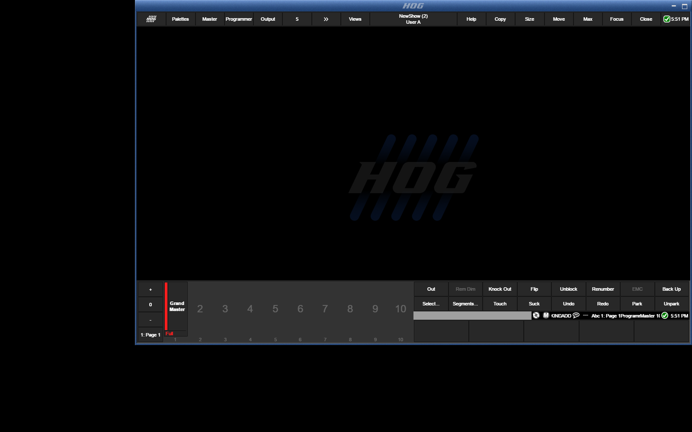

# Hog PC 5.2.1.31 on Wine

Hog and Hog PC are trademarks of Electronic Theatre Controls, Inc. (High End Systems). This repository is not associated with, affiliated with, supported nor endorsed by Electronic Theatre Controls, Inc. or High End Systems. No guarantees are made, as for the suitability of the content of this repository for any particular purpose.

No High End Systems or ETC software is redistributed here. The install media must come from your own vendor download; the scripts take it from `$HW_MEDIA` (see `env.sh`).

`Hog_PC_5.2.1.31.msi` (**High End Systems / ETC**, "Hog PC" — the Hog lighting-console PC software)
under a locally built, patched **Wine 11.18**, with the Windows reference taken from the libvirt guest
`win11`.



## Result — the app runs and behaves like it does on Windows

Hog PC installs, starts its launcher, creates a show, brings up its server and opens the **full console
UI**, with **no licence dialog, no HASP error and no hardware prompt** — exactly as on Windows, which
matches the owner's description that the hardware-attached licence gates *additional* functionality
rather than start-up.

| | Windows 11 guest | Wine 11.18 |
|---|---|---|
| MSI install | rc 0 | **rc 0** (577 MB to `C:\Program Files (x86)\ETC\HogPC`) |
| launcher | `"Hog Start"` **792x338** | `"Hog Start"` **792x338** |
| licence/HASP/hardware prompt | none | **none** |
| New Show → show files | `hogdatabase.mk2`, `hog_ident.json`, `blackbox/` | same three |
| children spawned | server + critical + desktop | **server (`-port=6600`) + desktop** |
| server socket | port 6600 | **listening on 0.0.0.0:6600** |
| console window | `"Hog PC - Primary Screen"` | `"Hog PC - Primary Screen"` (same size) |
| console top bar | `Palettes / Master / Programmer / Output / Views` | identical |
| Wine `err:` lines in the run | — | **0** |

**Call-level parity** (agent `HogApiDiff`, `docs/API_DIFF.md`, using an API tracer on *both* sides —
including a 32-bit tracer ported for this i386 app): *"Hog PC's start-up diverges nowhere on Wine that
stops, blocks or corrupts it. Locking of the show store is identical (1574 `LockFileEx`/`NtLockFile`
pairs on Windows vs 1584 on Wine for the same show-open burst, all success). No start-up-critical call is
missing in the launcher-vs-launcher diff; both sides end idle at `Hog Start`."* The only divergences are
cosmetic or degradation paths (`RegisterPowerSettingNotification` stub, `EnableNonClientDpiScaling`
returns FALSE, `DiInstallDriverA` hardware-only, `netprofm` change notifications never fire,
`WTSQuerySessionInformation(WTSSessionId)` returns FALSE for a Chromium caller, `SkipPointerFrameMessages`
not exported, plus body-level stubs listed in `docs/QT_CHROMIUM_SOURCE.md`).

Full detail: `docs/PARITY.md` (behaviour comparison), `docs/API_DIFF.md` (call diff),
`docs/VM_REFERENCE.md` (Windows), `docs/QT_CHROMIUM_SOURCE.md` (Qt 5.15.1 / Chromium 80.0.3987.163 →
Win32 call sites vs Wine), `docs/IMPORTS_RECON.md`, `FINDINGS.md` (M1–M3).

## Wine patches used (all in this directory)
`patches/README.md` documents every patch with its provenance. In short:

| | |
|---|---|
| `patches/series/0001..0019` | the requested **AutoCAD-on-Wine (14) + Power BI-on-Wine (5)** base — untouched copies under `patches/sources/` |
| `patches/local/0100-msi-class-registry-view.patch` | MSI picked the registry view from the package instead of the per-component 64-bit flag (written in `mastercam-wine`) |
| `patches/local/0101-services-service-logon-token.patch` | SCM-started services got an interactive token, so Go services never registered (written in `mastercam-wine`) |
| `patches/local/0102-iphlpapi-notify-interface-changes.patch` | `NotifyIpInterfaceChange` was a stub; `NotifyUnicastIpAddressChange` a semi-stub (written in `eos-wine`) |
| **`patches/local/0103-win32u-initial-client-paint.patch`** | **A newly shown window never got its initial queued `WM_PAINT`** — Hog's offline `Processor` window was created (770x370, visible, whole client area in its update region) but never painted, while Windows delivered `BeginPaint`+`EndPaint` for the same exe. Wine only synthesises `WM_PAINT` when the thread queue is empty, and the monitor's queue never drains. Fix: `dlls/win32u/window.c` `set_window_pos()` forces the first client paint on the hidden→visible transition. **Written in this project** (`docs/INITIAL_PAINT_PATCH.md`, evidence `docs/MONITOR_RENDER_RE.md`). |

All **23** (19 + `0100`–`0103`) are applied to **this project's own** `wine-11.18`, and the tree is
self-contained (no symlinks out; `wine-install/` is a real copy).

## Setup fixes that are *not* Wine patches (reproducible)
| fix | why | how |
|---|---|---|
| Windows 10 version in the prefix | vendor installers gate on it; Wine reads the `CurrentMajorVersionNumber`/`CurrentMinorVersionNumber` REG_DWORDs | `tools/mkprefix.sh` writes 10/0, build 19045, `CurrentVersion 6.3`, `ProductName` |
| Core fonts | Wine substitutes Arial/Verdana but does not *enumerate* them | `tools/mkprefix.sh --stage fonts` (needs a `corefonts.zip` in `vmshare/`) |

No other setup fix was needed — the MSI installs cleanly with `msiexec /i <msi> /qn /norestart`.

## Layout
| path | what it is |
|---|---|
| `wine-11.18/` | Wine 11.18 source with `patches/series/*` + `patches/local/*` applied |
| `wine/wine-11.18/` | the build tree (created on first build) |
| `wine-install/` | `make install` output; `wine-install/bin/wine` |
| `patches/` | every patch + `patches/README.md` manifest |
| `tools/` | build / prefix / run / probe / VM tooling, `tools/apitrace` (IAT tracer, 32-bit and 64-bit builds), `tools/relaydiff.py`, `tools/hog_apidiff.sh` |
| `docs/` | the evidence documents listed above |
| `state/work/prefix` | the Wine prefix Hog PC is installed in |
| `logs/`, `evidence/` | run logs, call logs, screenshots (Windows reference filmstrips too) |

## Reproduce
```sh
source env.sh
tools/apply_patches.sh wine-11.18          # 19 series + 3 local, forward-only
tools/build_wine.sh --jobs 8               # configure --enable-archs=i386,x86_64 && make && make install
tools/mkprefix.sh --fresh --stage all      # win10 version, fonts, Hog PC MSI
wine "C:\Program Files (x86)\ETC\HogPC\launcher-win32-golden.exe"
#  -> "Hog Start" 792x338 ; New Show -> Finish -> server on 6600 + "Hog PC - Primary Screen"
```
Interactive driving is done with `xdotool` on the TigerVNC display `:2`, with `tesseract` OCR and
`xwininfo` because the model has no vision; per-window captures of the GL/Qt console come back blank, so
the **root** capture is the evidence.

## Method
Install under Wine → run against `:2` → drive the UI → capture what the app asks Windows for and what it
asks Wine for → diff (`tools/apitrace` + `tools/relaydiff.py`) → patch Wine where it actually diverges.
For the **open-source** parts the owner flagged (Qt 5.15.1, Chromium 80.0.3987.163) the call sites are
read from source rather than disassembly (`docs/QT_CHROMIUM_SOURCE.md`, 820 Qt + 562 Chromium APIs mapped
to Wine with `@ stub`/body-level evidence).

## Netiquette
Not upstream-ready, and no merge request was opened: the work is AI-assisted, which is why the patches
live here rather than being submitted to Wine.
