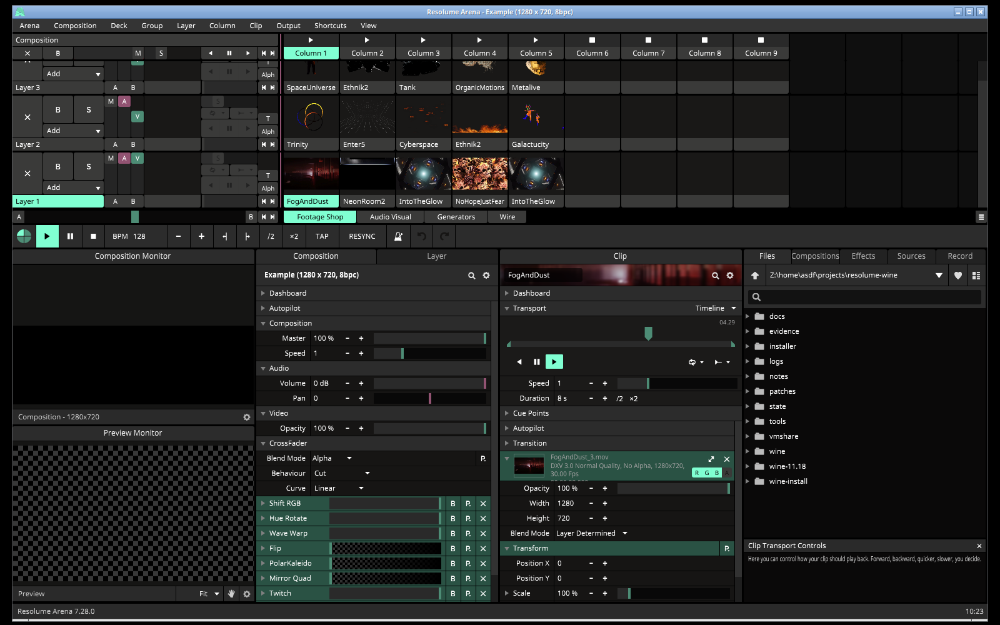

# Resolume Arena 7 on Wine

Resolume and Resolume Arena are registered trademarks of Resolume B.V. This repository is not associated with, affiliated with, supported nor endorsed by Resolume B.V. No guarantees are made, as for the suitability of the content of this repository for any particular purpose.

No Resolume software is redistributed here. The install media must come from your own Resolume download; the scripts take it from `installer/` or `$RES_MEDIA` (see `env.sh`).

`Resolume_Arena_7_28_0_rev_24303_Installer.exe` installs and **runs with its full UI** under a
patched Wine 11.18 built here. Two deficits had to be fixed — one a Wine patch, one a font
deployment — and both are in this directory.



## Result
`logs/runs/ui1_root.png` and the runs in `logs/runs/wine-final/` show the application's own UI:
composition / layer / clip grid, `Composition - 1280x720` and Preview monitors, transport (`BPM 128`),
the Composition / Layer / Clip panels with effects, the Files browser, and the status bar
`Resolume Arena 7.28.0` — the same surface the Windows reference guest shows
(`logs/vm-baseline/`).

## What was wrong, and what fixed it

**1. Wine: `IDXGIOutput::WaitForVBlank` was a stub returning `E_NOTIMPL`.**
Arena calls it while bringing up its display/output path (the last GPU call before the stall is
`dxgi!CreateDXGIFactory`). With no real wait the app idled with a black window — a `GetMessage` loop,
one worker polling `WaitForSingleObject(handle, 1ms)` ~900×/s, no paint calls — and never reached its
UI. `patches/local/0100-dxgi-output-WaitForVBlank.patch` paces the caller at the output's refresh
rate. **This is what unblocked startup.** Evidence: `FINDINGS.md` M13.

**2. Fonts: Wine substitutes Arial/Verdana for `CreateFont` but does not *enumerate* them.**
Arena looks up the font families `("Arial","Regular")` and `("Verdana","Regular")` (table at
`Arena.exe` VA `0x142f4fa00`); with no such family present it stops at
`INFO: Find default fonts / INFO: Default fonts not available`. Installing the real fonts into the
prefix fixes it — **documented in `docs/FONT_REQUIREMENT.md`**, automated by
`tools/install_corefonts.sh` (also called from `tools/mkprefix.sh`), verified with
`tools/winapi/fontprobe.exe`.

## Layout
| path | what it is |
|---|---|
| `wine-11.18/` | **pristine** Wine 11.18 (dl.winehq.org tarball) |
| `wine/wine-11.18/` | the patched + built tree: pristine + `patches/series/*` + `patches/local/*` |
| `wine-install/` | `make install` output; `wine-install/bin/wine` |
| `patches/series/` | `0001..0019` — the AutoCAD-on-Wine base (14) + Power-BI-on-Wine (5) series |
| `patches/sources/` | the untouched patch directories of those two projects |
| `patches/local/` | this project's patches (`0100-dxgi-output-WaitForVBlank.patch`) |
| `installer/` | the vendor installer + `installer/media_x/` (innoextract payload, 3.1 GB) |
| `docs/FONT_REQUIREMENT.md` | why the core fonts are required and how to install them |
| `tools/` | build / run / install / probe / tracing tooling (see `STATE.md`) |
| `state/work/prefix` | the Wine prefix the app is installed in |
| `logs/` | `runs/<tag>/` per run, `vm-baseline/` the Windows reference, build logs |
| `FINDINGS.md` | measured evidence, one milestone per result |
| `STATE.md` | the current position; read first when resuming |

## Build and run
```sh
source env.sh
tools/build_wine.sh --jobs 8      # configure --enable-archs=i386,x86_64 && make && make install
tools/mkprefix.sh                 # prefix, win10, core fonts, prerequisites, vendor installer
tools/run_arena.sh <tag> --secs 180 --iv 30      # run on DISP=:2 with screenshots
tools/build_wine.sh --inc                         # incremental rebuild after editing dlls/<name>
```
`tools/build_wine.sh` enforces a memory guard (this host also runs an 8 GiB Windows guest) and follows
the Wine wiki's "new WoW64" recipe. UI runs use the TigerVNC display `:2` (1600x1000x24) + openbox.

## Reference guest
`virsh start win11`; guest user `adsf`/`asdf`; command channel `tools/vm/vmcmd.sh '<powershell>'`.
Screenshots: `virsh screenshot win11 out.ppm`. Resolume is installed there too; because the guest has
no GPU, Mesa 26.2.3 (llvmpipe) `opengl32.dll` + `libgallium_wgl.dll` sit next to `Arena.exe` so the
UI can render (see `FINDINGS.md` M9).

## Netiquette
This is not upstream-ready and no upstream merge request was opened; the work is AI-assisted, which
is why the patch lives here rather than being submitted.
